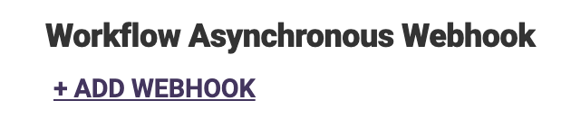
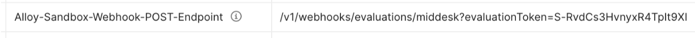
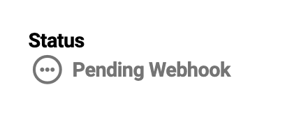

# Testing Middesk Webhooks

When creating evaluations in Alloy Sandbox mode, Middesk API responses are set up by default to return synchronously.

Note: Before following the below steps you will need to set up your webhook in the Alloy dashboard. If you have not done this yet, instructions can be found here.

1. Navigate to the workflow you are testing and attach the webhook:
 
    
    
    
2. Create an evaluation the same way you would for a normal Sandbox evaluation:
    1. Make sure to include the following two headers:
        1. `alloy-sandbox` : `true`
        2. `alloy-sandbox-use-webhooks` : `true`
        3. Example cURL request:
            
            ```bash
            curl -X POST https://sandbox.alloy.co/v1/evaluations \
              -H "Content-Type: application/json" \
              -u workflow_token:workflow_secret \
              -H "alloy-sandbox: true" \
              -H "alloy-sandbox-use-webhooks: true" \
              -d $'{
                "business_name": "My Test Company",
                ...
              }'
            ```
            
3. Once you've made your request, take a look at the response:
    1. The response body should look like this:
        
        ```json
        {
            "status_code": 202,
            "evaluation_token": "S-RvdCs3HvnyxR4TpIt9XI",
            "evaluation_status": "webhook_pending",
            "error": null,
            "timestamp": 1635526055246,
            "entity_token": "B-q5TtGIQ9jWYoD8KyAwe2",
            "parent_entity_token": null,
            "group_token": null,
            "application_token": "workflow_token",
            "application_version_id": 9,
            "webhook_pending_services": [
                "Middesk"
            ]
        }
        ```
        
    2. The headers for the response should include a special key called `Alloy-Sandbox-Webhook-POST-Endpoint` that contains a URL.
    
        
        
        
    3. And the evaluation in the dashboard should show up like this:
    
        
        
        
4. Use the URL from the response headers in Step 3 to create a new `POST` request. 
    1. This time, the request body should be empty, and your headers should only need to include:
        1. `alloy-sandbox` : `true`
    2. Example cURL request:
    
    ```bash
    curl -X POST https://sandbox.alloy.co/v1/webhooks/evaluations/middesk?evaluationToken=S-RvdCs3HvnyxR4TpIt9XI \
      -H "Content-Type: application/json" \
      -u workflow_token:workflow_secret \
      -H "alloy-sandbox: true" \
      -d $'{}'
    ```
    
5. Sending this `POST` request will return an  `200` "OK" response. Momentarily, you should see an Alloy outgoing webhook hit the client's asynchronous evaluation update endpoint (set up in Step B). You can use that data to `GET` details about the evaluation and/or entity.